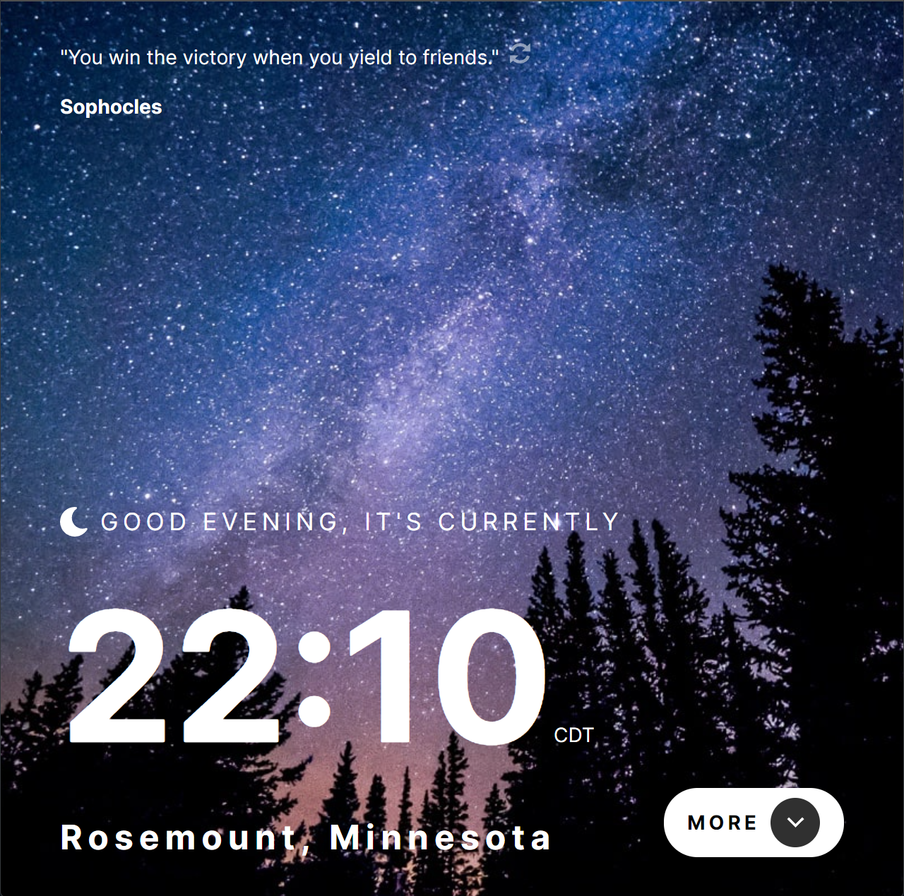
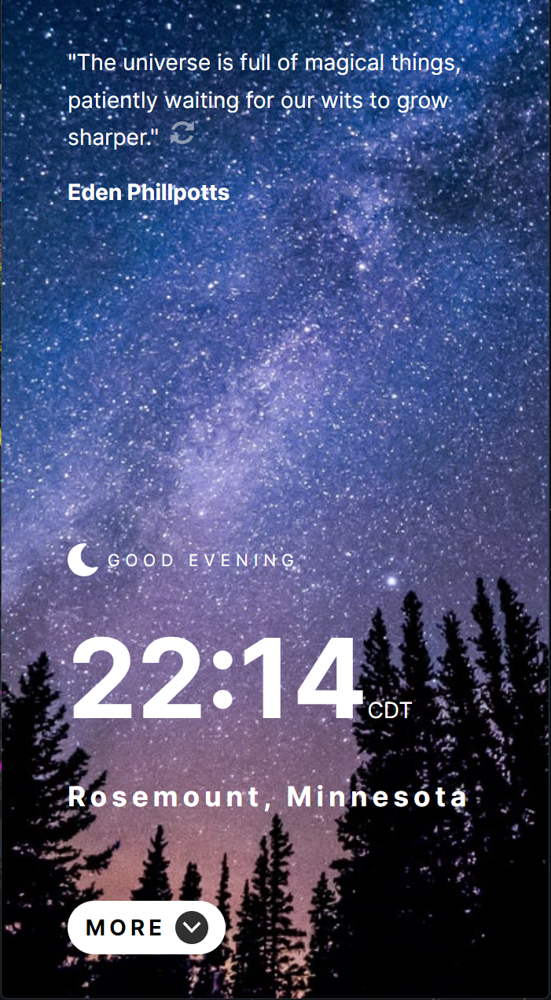

# Clock App [April 10th 2023]

This project is one of the intermediate Javascrpit challenges from [Frontend Mentor](https://www.frontendmentor.io/).

## Table of contents

- [Overview](#overview)
  - [Screenshot](#screenshot)
  - [Links](#links)
  - [Features](#features)
- [My process](#my-process)
  - [Built with](#built-with)
  - [Continued development](#continued-development)
  - [Useful resources](#useful-resources)
- [Author](#author)
- [Acknowledgments](#acknowledgments)

## Overview

In this project, my main goal was to work with multiple APIs in a single project with extra emphasis on resposivness with different screen sizes. I have also tried to reduce the use of fixed units by replacing them with Rem, Em etc.

### Screenshots

### Links

- Live Site URL: [Clock App](https://snazzy-kitsune-1e1661.netlify.app/)

### Features

- Renders new quote when button is clicked
- Displays a different background image based on the time of day
- Generated time based on the users location
- Displays info about the year

## My process

I started by looking at figma files and writing down the possible routes I can take in terms of setting up my files. I then structured my main component, then i used the figma file to get the appropriate colors and sizing to set up my CSS file and then i started adding additional components.

### Built with

- React

### Continued development

The code will need additional refactoring to make it cleaner and more DRY.

### Useful resources

- [Frontend Mentor](https://www.frontendmentor.io/).

## Author

- Jaron Denzel Young

## Acknowledgments

Thank you, Frontend Mentor, for being an awesome place to learn.
